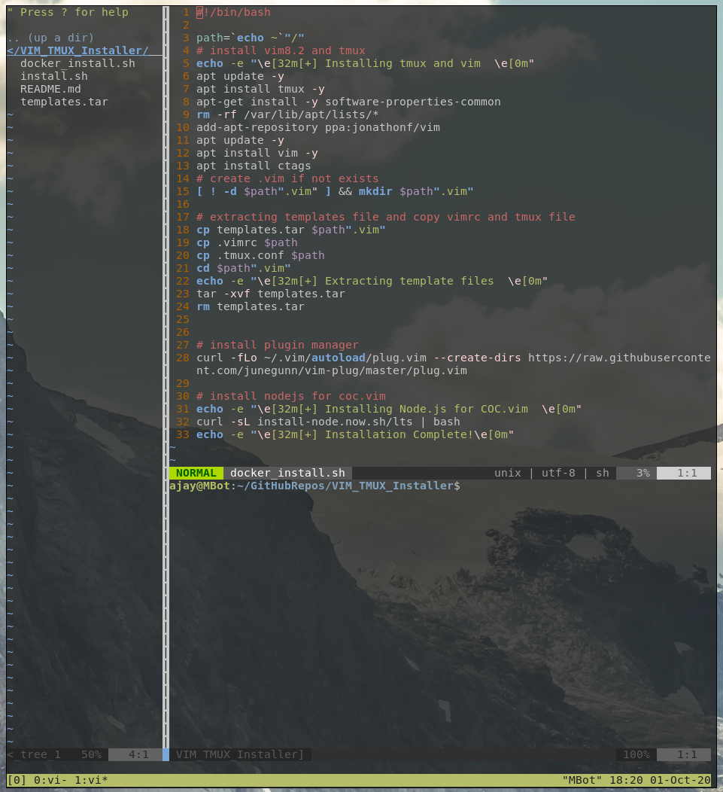

# VimTmuxInstaller  

Install vim and tmux along with configuration (see [.tmux.conf](.tmux.conf) and [.vimrc](.vimrc) file).     

* **install.sh** : For Linux systems (tested on ubuntu 18.04). 

* **docker_install.sh** : For docker container.

## Installation Steps : 

* Run the above shell scripts.   

```shell  
chmod +x install.sh  
sudo ./install.sh
```  

* Open vim and run command `:PlugInstall` to install all plugins.  
* Run the command `:CocInstall <language_server_name>` to install language server for coc.vim. Some of useful language servers are : coc-json, coc-css, coc-clangd, coc-html, coc-java, coc-python, coc-sh, coc-sql, coc-xml, coc-tsserver, coc-phpls. You can install them single or all of them by :   

```vim  
:CocInstall coc-json coc-css coc-clangd coc-html coc-java coc-python coc-sh coc-sql coc-xml coc-tsserver coc-phpls  
```  

  

## VIM Features :


Installed Plugins : nerdtree, lightline.vim, taglist.vim, coc.vim   

**Leader** key : `/`  

* Open NerdTree : `F2`
* Open TagList : `F3`  
* Open Terminal Vertical `Leader + v`
* Open Terminal Horizontal(below) : `Leader + v` 
* Unset/Set the Line number : `Leader + n`   
* Key for resize panels :    

```text  
Up : `Ctrl + Up`
Down : `Ctrl + Down`
Left : `Ctrl + Left`  
Right : `Ctrl + Right`  

Inside tmux session :   

Up : `Ctrl + k`
Down : `Ctrl + j`
Left : `Ctrl + h`  
Right : `Ctrl + l`    
```   

**Markdown Preview :** A function `Vim_MD_Preview` is defined which preview markdown file, which is currently setted for brave-browser which shows the preview by using extension [Markdown Viewer](https://chrome.google.com/webstore/detail/markdown-viewer/ckkdlimhmcjmikdlpkmbgfkaikojcbjk). So install brave-browser and Markdown extension in it, configure it to show file urls and auto-reload. then you are good to go and key for preview is `leader + s`.    

## Tmux features :   

Bind-key : `Ctrl + B`   

* Split vertical : `Bind + v`
* Split horizontal : `Bind + b` 
* Pane resize : `Bind + Arrow_key`  
* Pane Change `Bind` then `Arrow_key`
